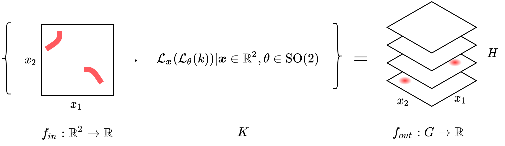
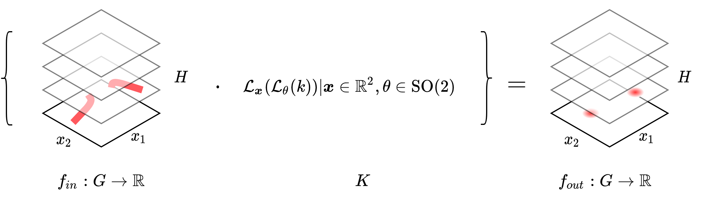
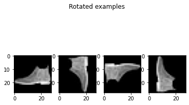
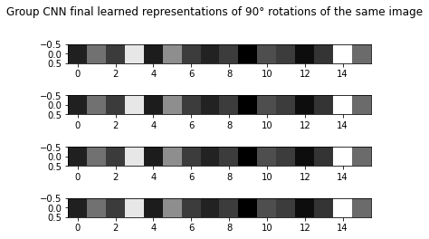
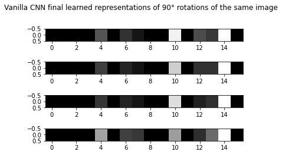

# Group Convolutional Neural Networks
Group Convolutional Neural Networks (G-CNNs) are a generalization of CNNs that reduces the data complexity by exploiting symmetries using Group Theory (you can learn more on the [original paper](https://arxiv.org/abs/1602.07576)).
This type of architecture falls under the category of **Geometric Deep Learning**, which is a subfield of Deep Learning that focuses on the development of algorithms that can learn from data with a known geometric structure.

This method provides **an alternative to data augmentation**, it increases the expressive capacity of the network without increasing the number of parameters by using weight sharing.

In this repository you will see the result of applying G-CNNs on the [Fashion-MNIST](https://arxiv.org/abs/1708.07747) dataset with rotations of multiples of 90°.

### Group CNN building blocks
A Group CNN is composed of the following building blocks:
- **Group lifting layer**: This layer is responsible for lifting the input data to the group representation.  *[Image source](https://uvadlc-notebooks.readthedocs.io/en/latest/tutorial_notebooks/DL2/Geometric_deep_learning/tutorial1_regular_group_convolutions.html#:~:text=these%20in%20order.-,2.1%20Lifting%20convolution,\)%20%2C%20for%20h%20%E2%88%88%20H%20)*
- **Group convolution layer**: This layer is responsible for applying the convolution operation in the group representation.  *[Image source](https://uvadlc-notebooks.readthedocs.io/en/latest/tutorial_notebooks/DL2/Geometric_deep_learning/tutorial1_regular_group_convolutions.html#:~:text=these%20in%20order.-,2.1%20Lifting%20convolution,\)%20%2C%20for%20h%20%E2%88%88%20H%20)*

### Example

